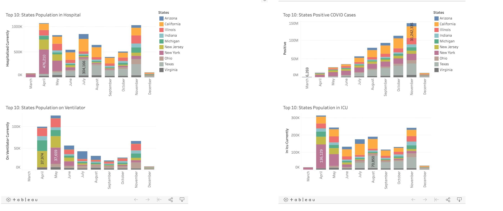
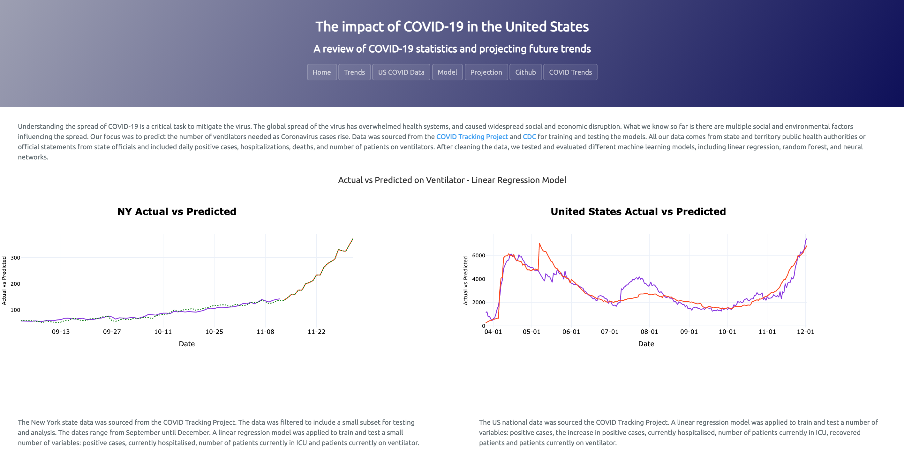

# COVID Predictions Dashboard 

## COVID Predictions Dashboard

*This updated Dashboard contains Tableau Charts.

Created individual pages and a means by which to navigate between them. The pages contain visualizations relating to the impact of COVID in the United States. Users can filter by state and review significant changes over time due to the pandemic. The home page includes an animated choropleth map that displays the rise in positive COVID cases and death across the U.S.

### Website 

For reference, see the ["Screenshots" section](#screenshots) below.

The website consists of 5 pages total, including:

* A [landing page](#Homepage) containing:
* 2 animated U.S choropleth maps. Positive COVID Cases & Deaths.

* Four [visualization pages](#visualization-pages), each with:
* A descriptive title and heading tag.
* The plot/visualization itself for the selected comparison.
* A ["COVID Data" page](#covid-page) that:
* Contains 10 Tableau visualizations on the same page so we can easily visually compare the data.
* A Bootstrap grid for the visualizations.
   
* A [Projection page](#projection-page) that:
* Neural network model - Plotly visulaization of predicted number of ventilaters required.

At the top of every page, the website includes a navigation menu that:

* Allows users to return to the home page from any page.
* Provides a link to each individual visualization page.
* Includes two external links: to the Github Repository and our previous project, COVID Trends dashboard

### Screenshots

This section contains screenshots of example pages to be built, at varying screen widths. These are a guide.

#### 

Home page:

COVID Trends:



#### 

COVID Data page:

Model page:

#### 

Projection page:

### Credits

All data, available for public use, is sourced from  The COVID Tracking Project, CDC, Google Community Mobility Reports, The Trump Archive and The New York Times. This project does not claim any ownership over the data, and is not reponsible for guaranteeing accuracy of the data.

### Dashboard Design
The dashboard was inspired by covid19-mobility.com 
