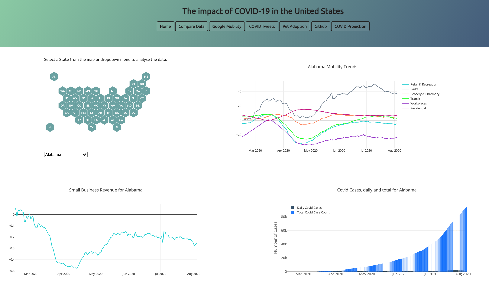
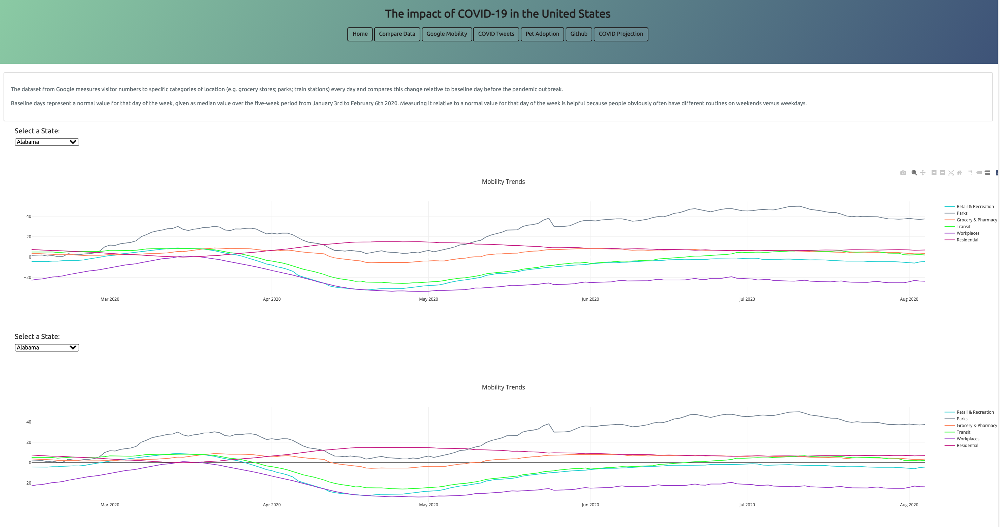
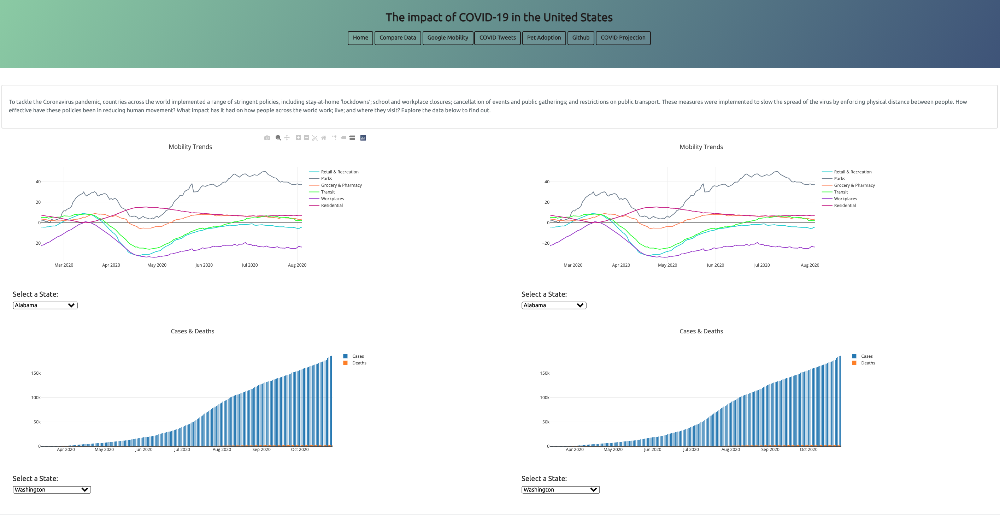
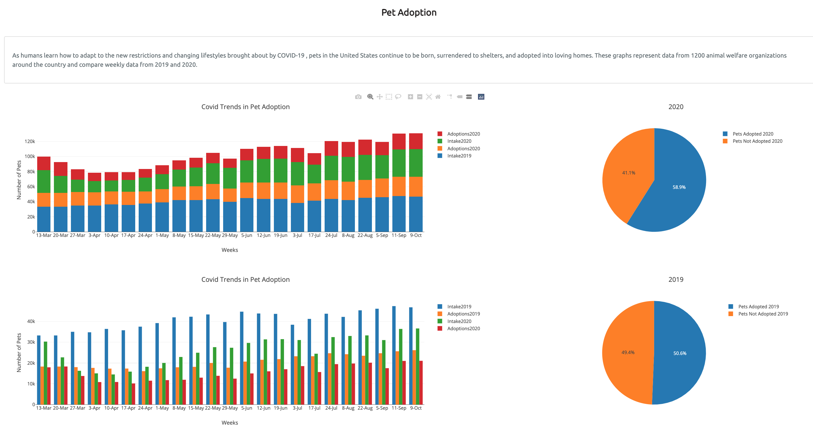

# COVID Trends Dashboard 

## COVID Trends Dashboard - Published here: https://covid-trends-us.herokuapp.com/index.html

Created and designed a dashboard using visualizations from the repository: COVID Trends: https://github.com/LisaHarrison08/COVID-Trends

Created individual pages and a means by which to navigate between them. The pages contain visualizations relating to the impact of COVID in the United States. Users can filter by state or date to review significant changes over time due to the pandemic. The home page includes a comparison of plots generated from data pertaining to small business revenue, COVID cases and deaths as well as Google Mobility data.

### Website 

For reference, see the ["Screenshots" section](#screenshots) below.

The website consists of 5 pages total, including:

* A [landing page](#Homepage) containing:
* 3 visualizations. Google Mobility, Small Business Revenue, COVID Cases
* Interactive Hexbin map and dropdown menu to select a state.

* Three [visualization pages](#visualization-pages), each with:
* A descriptive title and heading tag.
* The plot/visualization itself for the selected comparison.
* A ["Comparisons" page](#comparisons-page) that:
* Contains 4 visualizations on the same page so we can easily visually compare them.
* A Bootstrap grid for the visualizations.
   
* A [Trump Tweets page](#tweets-page) that:
* Displays a responsive table containing Trump tweets throughout March-August.

At the top of every page, the website includes a navigation menu that:

* Allows users to return to the home page from any page.
* Provides a link to each individual visualization page.
* Includes two external links: to the Github Repository and the follow up COVID projections dashboard
* Is responsive.

### Screenshots

This section contains screenshots of example pages to be built, at varying screen widths. These are a guide.

#### 

Home page:

Google Mobility:



#### 

Comparison page:

Pet Adoption page:

#### 

Tweets page:

### Credits

All data, available for public use, is sourced from Google Community Mobility Reports, The Trump Archive and The New York Times. This project does not claim any ownership over the data, and is not reponsible for guaranteeing accuracy of the data.

### Dashboard Design
The dashboard was inspired by covid19-mobility.com 
