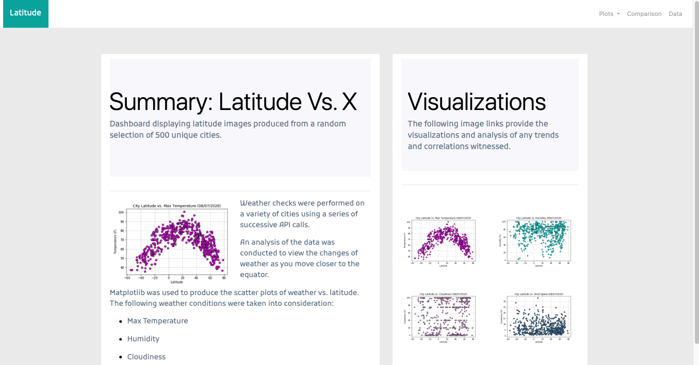
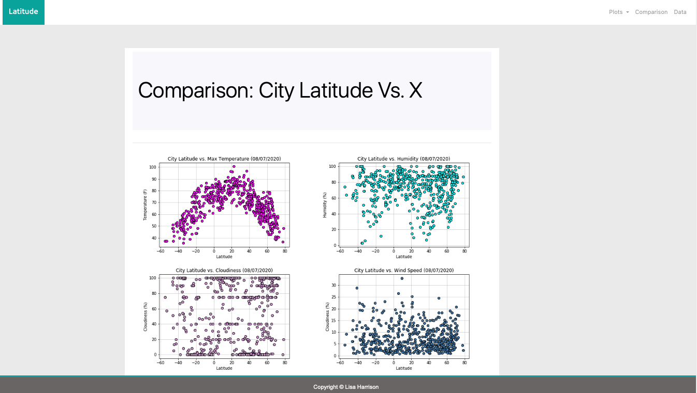
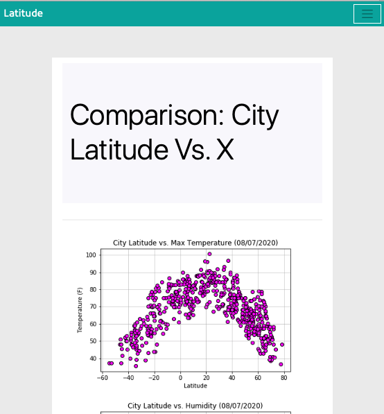
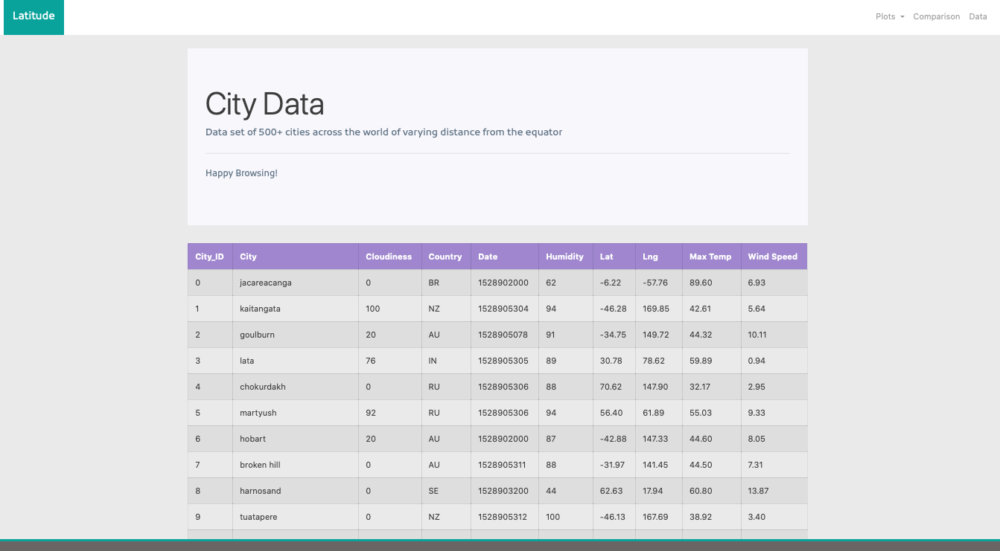
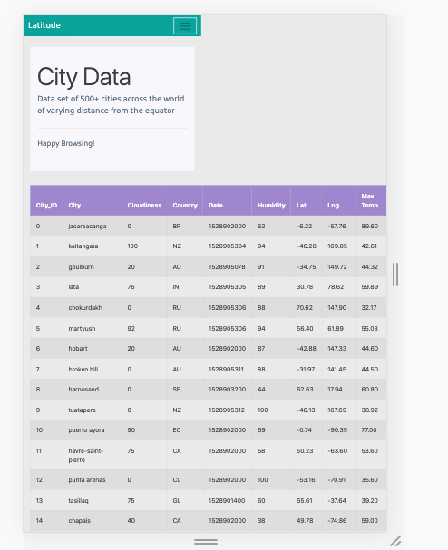
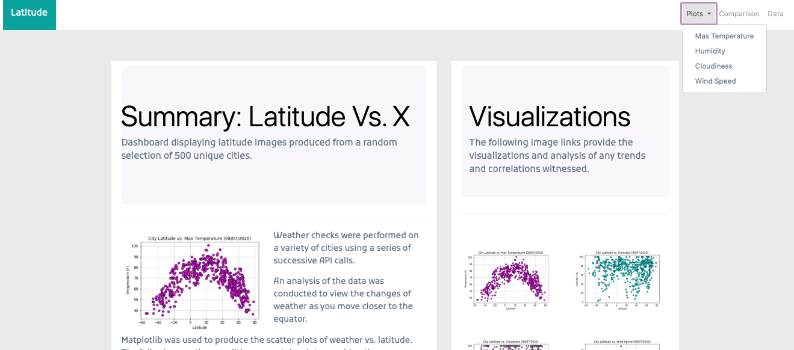
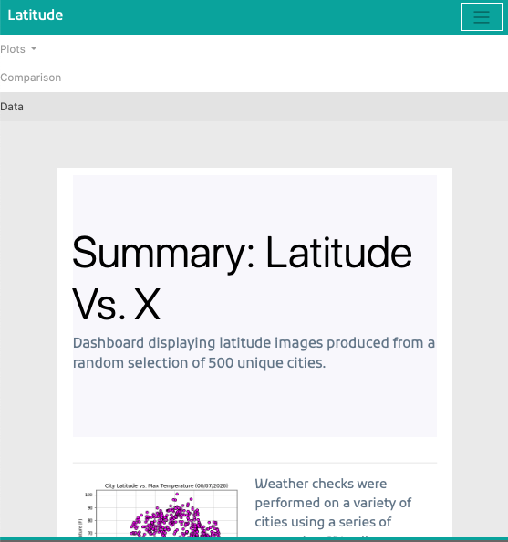

# Web Visualization Dashboard (Latitude)

## Latitude Analysis Dashboard - Published here: https://weather-visualization.herokuapp.com

Created and designed a dashboard using visualizations from the repository: Python APIs. 

Created individual pages for each plot and a means by which to navigate between them. The pages contain the visualizations and their corresponding explanations. Also included a landing page, a page where we can see a comparison of all of the plots, and another page where we can view the data used to build them.

### Website 

For reference, see the ["Screenshots" section](#screenshots) below.

The website consists of 7 pages total, including:

* A [landing page](#landing-page) containing:
* An explanation of the project.
* Links to each visualizations page. A sidebar containing preview images of each plot, and clicking an image will take the user to that visualization.

* Four [visualization pages](#visualization-pages), each with:
* A descriptive title and heading tag.
* The plot/visualization itself for the selected comparison.
* A paragraph describing the plot and its significance.
* A ["Comparisons" page](#comparisons-page) that:
* Contains all of the visualizations on the same page so we can easily visually compare them.
* A Bootstrap grid for the visualizations.
   
* A ["Data" page](#data-page) that:
* Displays a responsive table containing the data used in the visualizations.
* A bootstrap table component. 

At the top of every page, the website includes a navigation menu that:

* Has the name of the site on the left of the nav which allows users to return to the landing page from any page.
* Contains a dropdown menu on the right of the navbar named "Plots" that provides a link to each individual visualization page.
* Includes two text links: "Comparisons," which links to the comparisons page, and "Data," which links to the data page.
* Is responsive (using media queries). The nav has similar behavior as the screenshots ["Navigation Menu" section](#navigation-menu) (notice the background color change).

### Screenshots

This section contains screenshots of example pages to be built, at varying screen widths. These are a guide.

#### Landing page

Large screen:

Small screen:



#### Comparisons page

Large screen:

Small screen:

#### Data page

Large screen:

Small screen:

#### Visualization pages

You'll build four of these, one for each visualization. Here's an example of one:

Large screen:

Small screen:

#### Navigation menu

Large screen:

Small screen:

